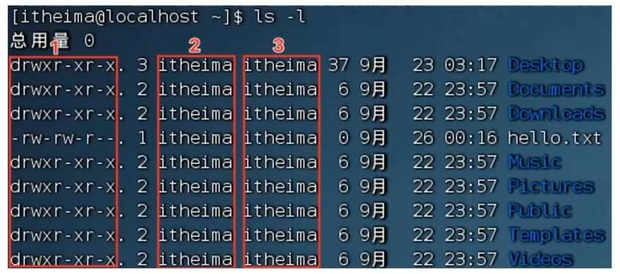
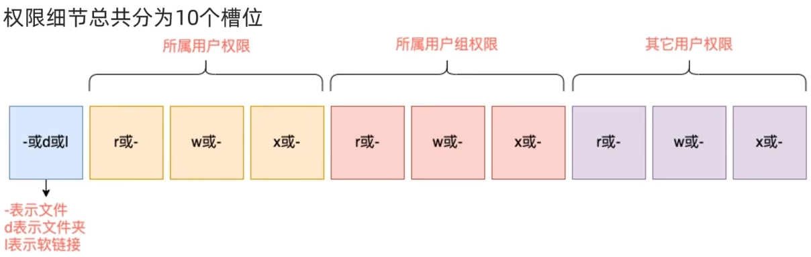

## Linux的root用户

1. Linux系统的超级管理员用户是：root用户
2. 普通用户的权限，一般在其HOME目录内是不受限的，一旦出了HOME目录，大多数地方，普通用户仅有只读和执行权限，无修改权限
3. su命令：可以切换用户
   `su [-] [用户名]`
   - \- ：表示切换后加载环境变量，建议带上
   - 用户可以省略，省略默认切换到root
4. exit命令
   - 切换用户后，可以通过exit命令返回上一个用户，也可以使用快捷键：ctrl + d
5. sudo命令：可以让一条普通命令带有root权限
   `sudo 其他命令`
   - 需要以root用户执行visudo命令，增加配置方可让普通用户有sudo命令的执行权限

## 用户、用户组

1. Linux系统中
   - 可以配置多个用户/用户组
   - 用户可以加入多个多个用户组中
2. Linux中关于权限的管控级别有2个
   - 针对用户的权限控制
   - 针对用户组的权限控制
     针对某文件，可以控制用户的权限，也可以控制用户组的权限

### 用户组管理

**以下命令需root用户执行**

1. 创建用户组
   `groupadd 用户组`
2. 删除用户组
   `groupdel 用户组`

### 用户管理

**以下命令需root用户执行**

1. 创建用户
   `useradd [-g -d] 用户`
   - -g选项：指定用户的组，不指定则会创建同名组并自动加入，指定-g需要组已经存在，如已存在同名组，必须使用-g
   - -d选项：指定用户的HOME路径，不指定，HOME目录默认在：/home/用户名
2. 删除用户
   `userdel [-r] 用户`
   - -r：删除用户的HOME目录，不使用-r，删除用户时候，HOME目录保留
3. 查看用户所属组
   `id [用户名]`
   - 参数：用户名，指被查看的用户，如果不提供则查看自身
4. 修改用户所属组
   `usermod -aG 用户组 用户名`
   - 将指定用户加入指定组
5. getent命令
   `getent passwd`
   - 查看当前系统中有哪些用户
   - 输出信息的格式：用户名：密码(x)：用户ID：组ID：描述信息(无用)：HOME目录：执行终端(默认bash)
     `getent group`
   - 查看当前系统中有哪些用户组
   - 输出信息的格式：组名称：组认证(显示为x)：组ID

## 查看权限控制信息

1. 认识权限信息
   通过`ls -l`命令可以以列表形式查看内容，并显示权限细节
   
   - 序号1：表示文件、文件夹的权限控制信息
   - 序号2：表示文件、文件夹所属用户
   - 序号3：表示文件、文件夹所属用户组
     
     举例：dwxr-xr-x表示
   - 这是一个文件夹，首字母d表示
   - 所属用户的权限是：有r有w有x，rwx
   - 所属用户组的权限是：有r无w有x，r-x
   - 其他用户的权限是：有r无w有x，r-x

   **rwx代表什么？**
   - r：读权限
     - 针对文件：可以查看文件内容
     - 针对文件夹：可以查看文件夹内容，如`ls`命令
   - w：写权限
     - 针对文件：可以修改该文件
     - 针对文件夹：可以在文件夹内创建、删除、改名等操作
   - x：执行权限
     - 针对文件：可以将该文件作为程序执行
     - 针对文件夹：可以更改工作目录到该文件夹，即cd进入

## chmod命令

1. 作用：修改文件/文件夹的权限信息(**只有文件/文件夹的所属用户/root用户可以修改**)
2. 语法
   `chmod [-R] 权限 文件或文件夹`
   - -R选项：对文件夹内的全部内容应用同样的操作
   - 示例：`chmod u=rwx,g=rx,o=x, hello.txt`,将权限修改为ewxr-x--x
     - 其中：u表示user所属用户权限，g表示group组权限，o表示other其他用户权限
3. 权限的数字序号
   - 权限可以用3位数字来代表，第一位数字表示用户权限，第二位表示用户组权限，第三位表示其他用户权限
   - 数字的细节如下：r记为4，w记为2，x记为1
     - 0：无任何权限，即---
     - 1：仅有x权限，即--x
     - 2：仅有w权限，即-w-
     - 3~7：类比...
   - 示例：`chmod 751 hello.txt`
     - 751代表：rwx(7)r-x(5)--x(1)

## chown命令

1. 作用：修改文件/文件夹的所属用户和用户组(此命令只适用于root用户执行)
2. 语法
   `chown [-R] [用户][:][用户组] 文件或文件夹`
   - -R选项：同chmod,对文件夹内全部内容应用相同规则
   - 用户选项：修改所属用户
   - 用户组选项：修改所属用户组
   - ：选项：用于分隔用户和用户组
3. 示例
   - `chown root hello.txt` 将hello.txt所属用户修改为root
   - `chown :root hello.txt` 将hello.txt所属用户组修改为root
   - `chown root:sakura hello.txt` 将hello.txt所属用户修改为root，用户组修改为sakura
   - `chown -R root test` 将文件夹test的所属用户修改为root并对文件夹内全部内容应用同样规则
