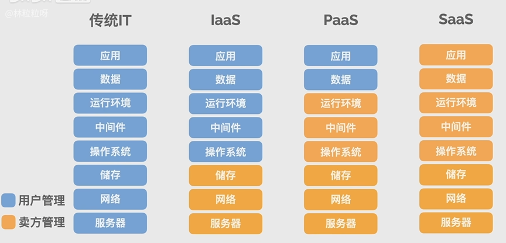

# 简要了解 
1. 云计算：通过互联网，**按需提供**的计算资源
2. 云计算的不同类型：IaaS、PaaS、SaaS
	+ IaaS：基础设施即服务
	+ PaaS：平台即服务
	+ SaaS：软件即服务
	
3. 云计算的优势
	+ 敏捷：在网上快速操作就能获得计算资源
	+ 弹性：可以根据需要 对计算资源实时调整
	+ 省钱：不需要买断服务器，实际用了多少资源就付多少费用
	+ 全球化：遍布全球的数据中心可以让计算资源离用户更近，降低延迟，提升体验
	+ 促进科技创新，大家只需要把时间和精力用在如何提供差异化服务上，而不用在服务器、数据库、网络等基础技术上消耗人力物力和财力。